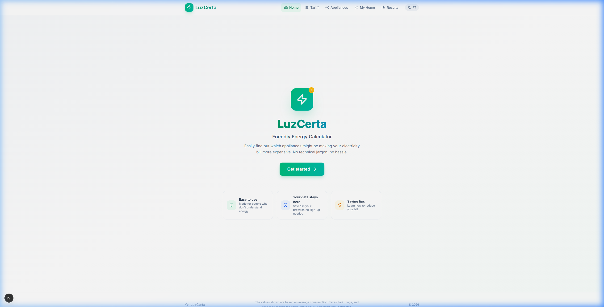

<div align="center">
  
  <h1>LuzCerta</h1>
  <p><strong>Friendly Energy Calculator — Built for People, not Engineers.</strong></p>

  <p>
    <a href="./README.md">🇧🇷 Português</a> | 🇬🇧 English
  </p>

  <div>
    
    
    
    
    
  </div>

  <div style="margin-top: 15px;">
    <a href="https://luz-certa-green.vercel.app/en" target="_blank">
      
    </a>
  </div>
</div>

<br />

## 📖 The Problem & The Family Context

This project was born from a real need. My mother had been complaining about the rising cost of our electricity bill but lacked a simple and practical way to check which of her appliances was consuming the most and whether the bill was correct.

Understanding electricity bills is tough for most people. The calculation involves confusing conversions from Watts to Kilowatts, multiplying by daily hours, days in a month, and tariff rates that no one memorizes.

When someone (like my mom) wonders: *"Is my electric shower making my bill too expensive?"*, online calculators require the user to know technical jargon (kWh, power, etc.), causing frustration for the average user.

## 💡 The Solution: LuzCerta

**LuzCerta** is an energy consumption calculator with an obsessive focus on **"Mother-Friendly" UX**. If your mom can't use the app, it failed.

- **Visual Dictionary:** Instead of asking for "Power in Watts", the app offers visual presets (Fridge, Electric Shower, TV) with pre-configured average values.
- **Intuitive Time Input:** Instead of typing "1.5 hours" into a numeric input, the user uses a friendly slider ("1 hour and 30 minutes").
- **Actionable Insights:** The app generates a consumption ranking ("The Shower accounts for 40% of your bill") and offers contextual saving tips based on what the user added.

### 📸 Homepage Demonstration



---

## ✨ Highlighted Features

🌍 **Native Internationalization (i18n)**
Bilingual support (Portuguese/English) implemented purely with Next.js 16 App Router Middleware (`[lang]`) and React Context for Client Components, with no heavy third-party dependencies. The language is detected via `Accept-Language` on the server-side.

🎨 **Premium & Accessible UI/UX**
Design system built with Tailwind CSS utilizing micro-interactions, glassmorphism, smooth gradients, and a harmonious color palette. Fully responsive.

⚡ **Efficient State Management**
No Redux or Zustand. Application state (tariff and appliance list) is managed via Custom Hooks (`useLocalStorage` + React Context), ensuring data persists without needing a backend or database.

🏗️ **Spec-Driven Architecture**
Developed strictly following the *Spec-Driven Development* pattern. Each feature has its PRD (Product Requirement Document), Implementation Plan, and Tasklist versioned within the `/implementation` folder.

---

## 🛠️ Tech Stack

- **Framework:** Next.js 16 (App Router, Turbopack)
- **Language:** TypeScript
- **Styling:** Tailwind CSS v4 + Lucide React (Icons)
- **i18n:** Negotiator + FormatJS (Content Negotiation Middleware)
- **Deployment:** Vercel (Recommended)

---

## 🚀 How to Run the Project

### Prerequisites
- Node.js (v18+)
- npm or yarn

### Step-by-Step

```bash
# Clone the repository
git clone https://github.com/your-username/luzcerta.git

# Enter the directory
cd luzcerta

# Install dependencies
npm install

# Start the development server
npm run dev
```

Open [http://localhost:3000](http://localhost:3000) in your browser to see the app. The language proxy will automatically redirect you to `/pt/` or `/en/`.

---

## 📂 Project Structure

```text
luzcerta/
├── implementation/       # Spec-Driven Documentation (PRDs, Tasks, Specs)
├── src/
│   ├── app/              # Next.js App Router (Layouts, Pages, Middleware)
│   │   ├── [lang]/       # Internationalized routes
│   │   └── proxy.ts      # Locale detector middleware
│   ├── components/       # Modularized React components
│   │   ├── appliance/    # Appliance logic and forms
│   │   ├── dashboard/    # Charts, rankings, and summaries
│   │   └── ui/           # Design System (Buttons, Inputs, Sliders, Modals)
│   ├── contexts/         # React Contexts (Dictionary)
│   ├── data/             # Static data (Appliance presets)
│   ├── dictionaries/     # Translation JSON files (PT/EN)
│   ├── hooks/            # Custom Hooks (useAppliances, useLocalStorage)
│   ├── lib/              # Utility functions and business rules
│   └── types/            # TypeScript Typings (Models)
```

---

## 🧠 Learnings and Decision Making

1. **i18n in Next.js 16:** We chose not to use libraries like `next-intl` to keep the bundle size minimal. We built a custom middleware using `negotiator` and `server-only` utils to deliver JSON dictionaries directly to Server Components.
2. **"Mother-Friendly" UX:** We learned that `input[type="number"]` with decimal steps (e.g., 0.25) alienates non-technical users. We built a custom `<TimeSlider />` that turns this into a draggable range displaying natural text ("X hours and Y minutes").
3. **Backend-less Persistence:** To ensure privacy and avoid friction (login/signup), we opted for a Custom Hook tied to `localStorage`.

---

## 🤝 How to Contribute

1. Fork the project
2. Create your Feature Branch (`git checkout -b feature/AmazingFeature`)
3. Commit your changes (`git commit -m 'Add some AmazingFeature'`)
4. Push to the Branch (`git push origin feature/AmazingFeature`)
5. Open a Pull Request

---

<div align="center">
  <p>Made with ❤️ by a UX-focused dev.</p>
</div>
